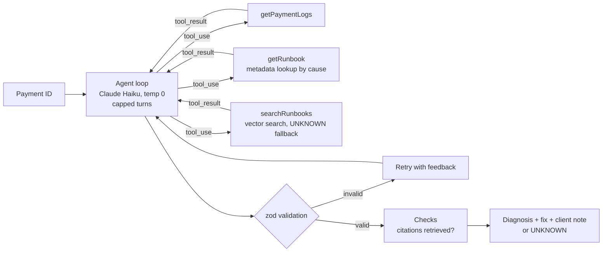

# Payment RCA Agent

An AI agent that finds out **why a payment failed**, quotes the log lines that prove it, pulls the fix from runbooks, and drafts a client-facing RCA note.

Built with **Node.js** and the **Claude API**, using tool calling, an agent loop, RAG over runbooks with local embeddings, structured output validation, and an eval suite that scores the agent against labelled test cases.

> All data in this repository is **synthetic**. No real bank, customer, or production data is used.

---

## The Problem

In payment platforms, failed and stuck payments (statuses like `RJCT`, `FAIL`, `PARK`, `PDNG`) land with a support engineer every day. For each one, the engineer has to:

1. Read the logs to find the real cause, not just the symptom
2. Find the right fix in the runbooks
3. Explain it to the client in plain language

This is slow, repetitive, and depends on who is on shift. This project automates the first-line diagnosis while keeping a human in control of the final call.

---

## What It Does

Give the agent a payment ID. It fetches what it needs through tools and returns:

```json
{
  "rootCause": "CBS_TIMEOUT",
  "confidence": "high",
  "evidence": [
    "CoreConnector: Processing queue status still 'IN_PROGRESS' after 60 seconds",
    "PaymentGateway: Closing transaction as failed, core never returned a final processing result"
  ],
  "reason": "Connection to core banking succeeded, but core never returned a result.",
  "suggestedFix": "Re-query the transaction status in core before any retry. If the debit posted, mark successful and reconcile; if not, retry once.",
  "clientNote": "The payment was delayed because the core banking system did not respond in time. It has now been [completed / safely retried / escalated].",
  "usedSections": ["cbs-timeout.md#checks", "cbs-timeout.md#fix", "cbs-timeout.md#client-communication"]
}
```

It classifies into a fixed set of root causes, and answers `UNKNOWN` instead of guessing when the evidence is unclear or the failure is outside the taxonomy.

| Root cause | Meaning |
|---|---|
| `CBS_TIMEOUT` | Connection to core banking succeeded, but core did not respond in time |
| `INSUFFICIENT_BALANCE` | Debit declined because the remitter's available balance was too low |
| `DUPLICATE_PAYMENT` | Same reference, key, or identical details already processed |
| `INVALID_BENEFICIARY` | Beneficiary account missing, inactive, or name/account mismatch |
| `CONFIG_ERROR` | A missing or wrong configuration, mapping, or setting |
| `NETWORK_ERROR` | The connection itself failed: DNS, refused, reset, unreachable, bad gateway |

---

## Architecture



**Offline:** `build-index.js` splits each runbook by section, adds the runbook title to every chunk, and embeds it locally with `all-MiniLM-L6-v2` (384 dimensions). The result is `data/index.json`, 36 chunks.

---

## Features and Status

Built step by step, with daily commits.

| Feature | Status |
|---|---|
| Claude API integration, system prompts, multi-turn conversations | Done |
| Synthetic labelled dataset: 30 base cases + 9 adversarial and abstain cases | Done |
| LLM-as-judge label checker for dataset quality | Done |
| Diagnosis prompt with taxonomy and `UNKNOWN` fallback | Done |
| Structured JSON output with zod validation and retry-with-feedback | Done |
| Runbooks, local embeddings, and vector search | Done |
| RAG pipeline: metadata lookup for known causes, vector search fallback | Done |
| Eval suite with per-difficulty and per-cause scores, saved runs | Done |
| Tool calling (`getPaymentLogs`) | Done |
| Agent loop with multiple tools and a turn limit | Done |
| REST API (Express) with API-key auth, timeouts, and retries | Planned |
| Guardrails: verify quoted evidence exists in the logs, enforce citations | Planned |

---

## Results

Claude Haiku 4.5, temperature 0, answer key removed from every record before it is sent.

| Test set | Cases | Score | Notes |
|---|---|---|---|
| Base (easy + hard) | 30 | **30/30** | 29/30 first run; the miss turned out to be a mislabelled test case, which was fixed |
| Adversarial | 6 | **6/6** | Misleading error codes, e.g. "core timeout" when the connection was never made |
| Abstain (answer is `UNKNOWN`) | 3 | **2/3 → [fill]/3** | Missed a fraud velocity rule (force-fit into `CONFIG_ERROR`); fixed with a general out-of-taxonomy rule |

| Retrieval | Score |
|---|---|
| Vector search with raw logs as the query | Recall@1 60%, Recall@3 67% |
| After redesign (diagnose first, then look up runbook by cause) | Exact for known causes |

These scores are on a small, synthetic set written with the help of the same model family, so they show the pipeline works end to end. They are not a claim of production accuracy.

---

## Key Findings

**Search was the weak part, not the LLM.** Searching runbooks with raw logs found the right one only 60% of the time, while the diagnosis was correct on the same sample. Logs share a lot of generic lines. Diagnosing first and then looking up the runbook by cause fixed it.

**Check the answer key before blaming the model.** The only base-set miss was a test case labelled as a duplicate where the logs showed a timeout with the retry blocked. The model was right; the label was wrong.

**Prompt rules reduce bad behaviour but don't guarantee it.** With zero runbook sections, the fix correctly said "not covered", but the client note still invented a promise to the client. Critical rules now live in code: no runbook means no LLM call, just escalation.

**Self-reported confidence is not reliable.** The model said "high" on nearly every case, including hard ones. Real confidence should come from checks, not from asking the model.

---

## Design Decisions

**Root cause, not symptom.** A payment declined for low balance may have been caused by an earlier duplicate debit. The dataset tests this explicitly.

**A fixed taxonomy with written definitions.** Free text can't be scored. Six labels with clear definitions (for example, the line between `CBS_TIMEOUT` and `NETWORK_ERROR`) make results measurable.

**`UNKNOWN` as a safe exit.** A wrong RCA sent to a bank is worse than "a human needs to look at this". `UNKNOWN` is tested with its own abstain cases.

**Use AI only where a rule can't do the job.** For a known cause, the runbook is looked up directly by label. Vector search is only used when the cause is `UNKNOWN`.

**Local embeddings.** Free, offline, and runbook text never leaves the machine, which matters for banks.

**Tools are read-only.** The model can only ask for data; the code decides what to run. Even a model tricked by text inside a log line cannot change anything.

**LLM output is untrusted input.** Every response is validated with zod. Invalid output gets one retry with the error fed back.

**Evidence must be quoted, line by line.** Evidence is an array of exact log lines, so it can be checked automatically against the real logs.

**No data leakage.** Labels are removed from each record before it reaches the model.

---

## Tech Stack

- **Runtime:** Node.js (ES modules)
- **LLM:** Claude API (`@anthropic-ai/sdk`), Claude Haiku 4.5
- **Embeddings:** `@huggingface/transformers` with `Xenova/all-MiniLM-L6-v2`, run locally
- **Retrieval:** cosine similarity in plain JavaScript, metadata filtering
- **Validation:** zod
- **API (planned):** Express.js

---

## Project Structure

```
payment-rca-agent/
├── data/
│   ├── payments.json        # 30 labelled synthetic payments (easy + hard)
│   ├── hard-cases.json      # 6 adversarial + 3 abstain cases
│   ├── taxonomy.json        # root-cause labels and definitions
│   └── index.json           # 36 embedded runbook chunks
├── runbooks/                # 6 runbooks, one per root cause
├── results/                 # saved eval runs (model + per-case results)
├── agent.js                 # agent loop with multiple tools
├── tools.js                 # tool definitions and read-only implementations
├── prompts.js               # shared system prompt and rules
├── diagnoser.js             # diagnose(): JSON output, zod schema, retry
├── rag-agent.js             # two-step pipeline: diagnose, retrieve, recommend
├── tool-agent.js            # single tool-call example (getPaymentLogs)
├── build-index.js           # chunks and embeds runbooks
├── rag.js                   # search(query, k, source)
├── eval.js                  # scores diagnosis against labelled cases
├── gen-data.js              # generates the synthetic dataset
├── check-labels.js          # LLM-as-judge label verification
├── utils.js                 # getText(), extractJson()
└── README.md
```

Early learning scripts (`hello.js`, `chat.js`, `diagnose.js`, `*-demo.js`) are kept to show how the project was built.

---

## Getting Started

**Prerequisites:** Node.js 18+ and an Anthropic API key from [console.anthropic.com](https://console.anthropic.com).

```bash
git clone https://github.com/sinhaa-aankit/payment-rca-agent.git
cd payment-rca-agent
npm install
```

Create a `.env` file in the project root:

```
ANTHROPIC_API_KEY=your-key-here
```

Build the runbook index (first run downloads a ~23 MB embedding model):

```bash
node build-index.js
```

Run it:

```bash
node agent.js                         # triage sample payment IDs with the agent
node eval.js data/payments.json       # score the 30 base cases
node eval.js                          # score adversarial + abstain cases
```

---

## Roadmap

- [x] RAG over runbooks with local embeddings and vector search
- [x] Eval suite with before/after tracking
- [x] Adversarial and abstain test cases
- [x] Tool calling and an agent loop
- [ ] Express `POST /triage` with API-key auth, timeouts, and retries
- [ ] Guardrails: verify quoted evidence against the logs, reject uncited fixes
- [ ] Hybrid search (keyword + vector) for exact error codes
- [ ] Larger, human-labelled test set

---

## Author

**Ankit Kumar Sinha**, backend engineer working on bank payment integrations.
[LinkedIn](https://www.linkedin.com/in/ankit-kumar-sinha) · [GitHub](https://github.com/sinhaa-aankit)
