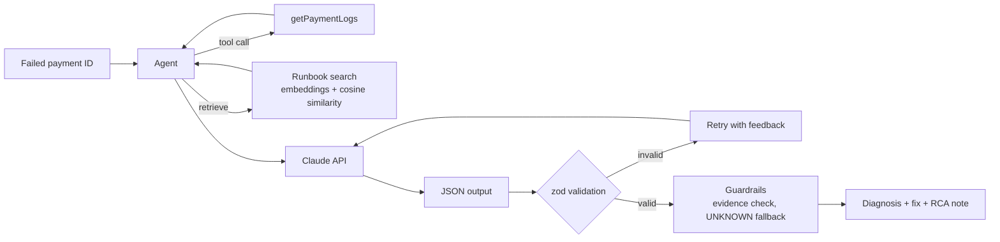

# Payment RCA Agent

An AI agent that diagnoses **why a payment failed**, points to the exact log evidence, suggests the fix from runbooks, and drafts a client-facing RCA note.

Built with **Node.js** and the **Claude API**, using prompt engineering, structured output validation, RAG (retrieval-augmented generation), tool calling, and an evaluation suite that measures accuracy against labelled test cases.

> All data in this repository is **synthetic**. No real bank, customer, or production data is used.

---

## The Problem

In payment platforms, failed and stuck payments (statuses like `RJCT`, `FAIL`, `PARK`, `PDNG`) land with a support engineer every day. For each one, the engineer has to:

1. Dig through logs to find the real cause (not just the symptom)
2. Look up the right fix in runbooks
3. Explain it to the client in plain language

This is slow, repetitive, and depends heavily on who is on shift. This project automates that first-line diagnosis while keeping a human in control of the final call.

---

## What It Does

Given a failed payment, the agent returns:

```json
{
  "rootCause": "CBS_TIMEOUT",
  "confidence": "high",
  "evidence": "No response received from core after 30s",
  "reason": "Connection to core banking succeeded, but core did not reply in time.",
  "suggestedFix": "Check core banking health; re-query transaction status before any retry.",
  "rcaNote": "The payment was held because the core banking system did not respond within the allowed window..."
}
```

It classifies into a fixed set of root causes, and answers `UNKNOWN` instead of guessing when the evidence is unclear.

| Root cause | Meaning |
|---|---|
| `CBS_TIMEOUT` | Connection to core banking succeeded, but core did not respond in time |
| `INSUFFICIENT_BALANCE` | Debit declined because the remitter's available balance was too low |
| `DUPLICATE_PAYMENT` | Same reference, key, or identical details already processed |
| `INVALID_BENEFICIARY` | Beneficiary account missing, inactive, or name/account mismatch |
| `CONFIG_ERROR` | A missing or wrong configuration, mapping, or setting |
| `NETWORK_ERROR` | The connection itself failed: DNS, refused, reset, unreachable, bad gateway |

---

## Architecture



---

## Features and Status

This project is being built incrementally, with daily commits.

| Feature | Status |
|---|---|
| Claude API integration, system prompts, multi-turn conversations | Done |
| Synthetic labelled dataset (30 failed payments, 6 causes, easy and hard cases) | Done |
| LLM-as-judge label checker for dataset quality | Done |
| Root-cause diagnosis prompt with taxonomy and `UNKNOWN` fallback | Done |
| Structured JSON output with zod schema validation and retry-with-feedback | Done |
| Runbook retrieval with embeddings and vector search (RAG) | In progress |
| Evaluation suite with accuracy scoring | Planned |
| Tool calling and agent loop (`getPaymentLogs`, runbook search) | Planned |
| REST API (Express) with API-key auth, timeouts, and retries | Planned |
| RCA note generation and hallucination guardrails | Planned |

---

## Design Decisions

**Root cause, not symptom.** A payment declined for low balance may actually have been caused by an earlier duplicate debit. The prompt and dataset explicitly test this distinction.

**A fixed taxonomy with written definitions.** Free-text answers can't be scored. Six labels with precise definitions (for example, the boundary between `CBS_TIMEOUT` and `NETWORK_ERROR`) make results measurable and consistent.

**`UNKNOWN` as a safe exit.** Forcing a choice between six labels pushes the model to guess. Allowing `UNKNOWN` reduces confident hallucinations.

**LLM output is treated as untrusted input.** Every response is parsed and validated against a zod schema, the same way you'd validate an external API response. Invalid output gets one retry with the validation error fed back to the model.

**Temperature 0 for classification.** Diagnosis should be as repeatable as possible; randomness is reserved for data generation.

**Evidence must be quoted.** The model must cite the log line that proves its answer, which enables an automated check that the evidence actually exists in the logs.

**No data leakage.** Labels are stripped from each record before it is sent to the model, so evaluation scores reflect real performance.

---

## Tech Stack

- **Runtime:** Node.js (ES modules)
- **LLM:** Claude API (`@anthropic-ai/sdk`)
- **Validation:** zod
- **API (planned):** Express.js
- **Retrieval (planned):** embeddings + cosine similarity in plain JavaScript

---

## Project Structure

```
payment-rca-agent/
├── data/
│   ├── payments.json        # 30 synthetic labelled failed payments
│   └── taxonomy.json        # root-cause labels and definitions
├── utils.js                 # response text extraction, JSON parsing
├── gen-data.js              # generates the synthetic dataset
├── check-labels.js          # LLM-as-judge label verification
├── diagnose.js              # diagnosis with a structured text prompt
├── diagnose-json.js         # diagnosis with JSON output, schema validation, retry
└── README.md
```

---

## Getting Started

**Prerequisites:** Node.js 18+ and an Anthropic API key from [console.anthropic.com](https://console.anthropic.com).

```bash
git clone https://github.com/sinhaa-aankit/payment-rca-agent.git
cd payment-rca-agent
npm install
```

Create a `.env` file in the project root:

```
ANTHROPIC_API_KEY=your-key-here
```

Run a diagnosis on the sample set:

```bash
node diagnose-json.js        # easy cases
node diagnose-json.js hard   # hard cases
```

---

## Early Results

On a sample of 12 cases (one easy and one hard per root cause), using Claude Haiku at temperature 0:

| Set | Score |
|---|---|
| Easy | 6/6 |
| Hard | 6/6 |

A full evaluation suite on all 30 cases, plus harder adversarial cases, is on the roadmap. A perfect score on a small sample mainly shows the test set needs to get harder.

---

## Roadmap

- [ ] RAG over runbooks with embeddings and vector search
- [ ] Full evaluation suite with before/after accuracy tracking
- [ ] Tool calling and an agent loop
- [ ] Express REST endpoint with authentication and error handling
- [ ] RCA note generation with evidence-verification guardrails
- [ ] Harder adversarial test cases

---

## Author

**Ankit Kumar Sinha**, backend engineer working on bank payment integrations.
[LinkedIn](https://www.linkedin.com/in/ankit-kumar-sinha) · [GitHub](https://github.com/sinhaa-aankit)